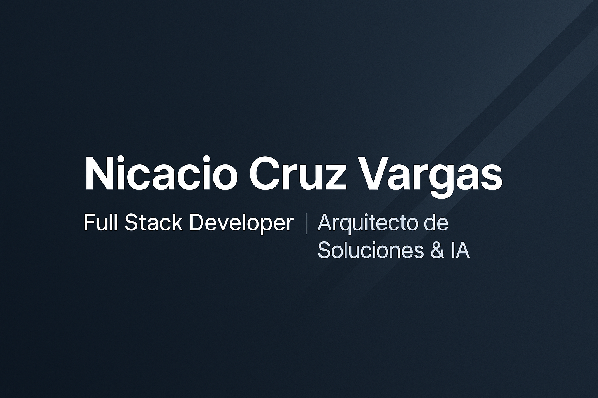

  

<h1 align="center">👋 Hola, soy Nicacio Cruz Vargas</h1>
<h3 align="center">Full Stack Developer · Arquitecto de Soluciones & IA</h3>

---

## 🚀 Sobre mí
Soy un desarrollador Full Stack especializado en crear soluciones empresariales modernas, escalables y de alto rendimiento.  
Tengo experiencia construyendo plataformas **multiempresa**, sistemas de **automatización fiscal**, aplicaciones multiplataforma y herramientas avanzadas con **IA local (Ollama)**.

Me apasiona la arquitectura limpia, el diseño de microservicios, la optimización de procesos y la creación de herramientas que aporten valor real a las empresas.

---

## 🧠 Áreas donde aporto valor
- Desarrollo **Frontend & Backend** avanzado  
- Arquitectura de Software y Sistemas Empresariales  
- Plataformas **SaaS Multi-tenant**  
- Integraciones API REST, SOAP y microservicios  
- Inteligencia Artificial local (Ollama – LLMs)  
- DevOps: CI/CD, pipelines, despliegues en la nube  
- Desarrollo multiplataforma con Avalonia  
- Automatización de procesos y análisis avanzado  

---

## 🛠️ Tecnologías Principales

### **Backend**
Laravel · PHP · .NET (C#) · Python · Node.js

### **Frontend**
Angular · Vue.js · TypeScript · Tailwind · Bootstrap

### **Escritorio / Multiplataforma**
AvaloniaUI · C# · LibreHardwareMonitor · Smartmontools

### **DevOps / Infraestructura**
Nginx · Docker · Azure DevOps Pipelines · AWS Lightsail · S3

### **Bases de datos**
MySQL · PostgreSQL · SQL Server · Firebird

---

## 📂 Proyectos Destacados

### 🔹 **Vantix – Plataforma Inteligente de Monitoreo de Hardware**
- C# + Avalonia + Python  
- Lectura avanzada de sensores  
- Atributos SMART, análisis térmico y salud del sistema  
- Reportes en JSON, Excel y PDF  
- IA integrada para recomendaciones usando Ollama  

---

### 🔹 **BHR-APP – Automatización CFDI y Auditoría Fiscal**
- .NET + Angular  
- Validación fiscal (TAX-01 a TAX-15)  
- Motor de reglas y análisis automático  
- Módulo de auditoría, extracción CFDI, reportes y conciliación  

---

### 🔹 **CRM Multiempresa (SaaS)**
- Laravel Tenancy  
- Subdominios dinámicos por cliente  
- Módulos de RH, empleados, reportes personalizados  
- Dashboards, KPIs, roles y permisos avanzados  

---

## 📈 Metodologías y Prácticas
- Arquitectura Limpia  
- Domain-Driven Design  
- Microservicios  
- CI/CD  
- Versionado Git profesional  
- Seguridad Web (CSRF, XSS, SQL Injection, MFA)  

---

## 📫 Contacto
📧 **Email:** nicaciocv@gmail.com  
📞 **Tel:** 489 197 8600  
🌐 **LinkedIn:** *(puedo generarte uno profesional si lo necesitas)*  

---

  ⭐ Si te gusta mi trabajo, considera dejar una estrella en alguno de mis repositorios.

